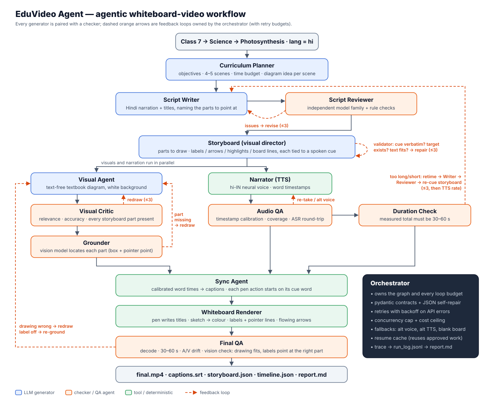

# EduVideo Agent — agentic AI whiteboard-video generator

Give it a topic such as **`Class 7 → Science → Photosynthesis`** and a team of AI agents produces a
30–60 second **whiteboard explainer video with Hindi narration** (or another Indian language):

- a pen **writes** each scene title,
- the diagram is **sketched stroke by stroke**, then coloured in,
- Hindi **labels are written with pointer lines** to the exact part they name,
- **arrows draw themselves and keep flowing** to show movement (water rising, light arriving, gas entering),
- summary lines such as the word equation are **handwritten on the board**,
- captions **highlight each word as it is spoken**.

Every pen action starts on the word the narrator is saying. Every generating agent is paired with a
checking agent, and the orchestrator regenerates any component that fails its check.

**Sample output:** [`samples/class7-science-photosynthesis-hi/final.mp4`](samples/class7-science-photosynthesis-hi/final.mp4)
with its [run report](samples/class7-science-photosynthesis-hi/report.md),
[storyboard](samples/class7-science-photosynthesis-hi/storyboard.json),
[captions.srt](samples/class7-science-photosynthesis-hi/captions.srt) and full
[agent trace](samples/class7-science-photosynthesis-hi/run_log.jsonl).


| Sample run | Result |
|---|---|
| Length | **51.6 s** (requirement: 30–60 s), 5 scenes, Hindi narration |
| A/V drift (video vs audio stream) | **3 ms** |
| Pen actions started on their spoken cue word | **17 / 17**, median start lag **0 ms** (32 animation events in total) |
| TTS timestamp calibration | edge-tts timestamps led the audible speech by 95–190 ms; corrected before anything was scheduled |
| ASR round-trip (narration heard vs script) | 0.98–1.00 on every scene |
| Script review | rejected twice (7/10, 8/10: the word equation was missing, then scene 5 was too long), approved in round 3 (9/10) |
| Storyboard validator | 2 issues repaired on the first draft; 7 cue issues repaired after the narration was retimed |
| Duration loop | first narration measured 58.5 s → writer shortened all scenes → re-reviewed → re-narrated → 51.6 s |
| Visual critic + grounder | all 5 drawings 10/10, every storyboard part located |
| Final QA (vision check of every scene's final frame) | PASS 5/5 |

The sample was produced by one full run ($1.85, 8.6 min). It was then re-rendered twice from the
same cached script, storyboard and audio after two renderer fixes: arrow tags now avoid labels,
and dense textures are thinned in the sketch. The first re-render also redrew four drawings
because of a cache-key bug, since fixed. `run_log.jsonl` contains all three sessions; total spend
was $2.73.

---

## Quick start

Requirements: **Python 3.12+** and an **OpenRouter API key**. Nothing else needs a system install:
ffmpeg comes as a static binary via `imageio-ffmpeg`, and Indic text shaping uses
HarfBuzz/FreeType wheels. On Linux, install Noto fonts (`sudo apt install fonts-noto-core`); macOS
and Windows already ship suitable fonts.

```bash
# with uv (recommended)
uv sync
cp .env.example .env            # then put your OPENROUTER_API_KEY in .env
uv run eduvideo "Class 7 → Science → Photosynthesis"

# or with pip
python -m venv .venv && source .venv/bin/activate
pip install -r requirements.txt && pip install -e .
eduvideo "Class 7 → Science → Photosynthesis"
```

Other ways to call it:

```bash
uv run eduvideo --grade 8 --subject Science --topic "Friction" --lang hi --seconds 40
uv run eduvideo "Class 6 → Geography → The Water Cycle" --lang mr        # Marathi
uv run eduvideo "Class 7 → Science → Photosynthesis" --models fast       # ~3x cheaper models
uv run eduvideo "Class 7 → Science → Photosynthesis" --resume output/<run-dir>   # continue a partial run
```

| Flag | Meaning |
|---|---|
| `--lang` | `hi` (default), `mr`, `bn`, `gu`, `ta`, `te`, `kn`, `ml`, `en` |
| `--seconds` | target length, 30–60 (default 45) |
| `--models` | `best` (default) or `fast`; see [Models](#models) |
| `--resume DIR` | reuse the approved plan, script, storyboard, audio and drawings from a previous run |
| `--no-images` | skip image generation (board with handwritten text only) |
| `--no-asr-check` | skip the ASR round-trip audio check |

With the `best` models a run takes about 8–9 minutes and costs about **$1.30–1.90** in OpenRouter
credits (five pro-tier illustrations plus critic/grounder calls are most of it); `--models fast` is
about $0.40. `EDUVIDEO_MAX_COST_USD` sets a hard ceiling per run (default $4).

### Output (`output/<run>/`)

| File | Content |
|---|---|
| `final.mp4` | 1280×720, 25 fps, H.264 + AAC |
| `storyboard.json` | per scene: parts to draw, and every label/arrow/highlight/board line with its cue word |
| `timeline.json` | every pen action, caption and scene on one clock (absolute seconds) |
| `captions.srt`, `word_timestamps.json` | captions and calibrated per-word timings |
| `report.md` | human-readable account of every agent decision, retry, score, timing and cost |
| `run_log.jsonl` | raw trace of every agent event and API call |
| `plan.json`, `script.json`, `images/`, `audio/`, `keyframes/` | intermediate artefacts (also the resume cache) |

---

## Architecture



| Agent | Produces | Checked by |
|---|---|---|
| **Curriculum Planner** | learning objectives, 4–5 scenes with time budgets, one diagram idea per scene | deterministic normaliser (scene count, time budget) |
| **Script Writer** | Hindi narration and titles that name the parts to point at | **Script Reviewer** |
| **Script Reviewer** (different model family from the writer) | approve/reject with severity-ranked issues | plus rules: ≥97 % Devanagari, no Latin/symbols the voice would misread, per-scene word budget |
| **Storyboard** (visual director) | per scene: layout (diagram / board), parts to draw, labels, arrows, highlights and board lines, each tied to a **cue**: words copied from the narration | deterministic validator: cue verbatim in narration, target part exists, text fits, counts per layout; failures go back for repair |
| **Visual Agent** | a text-free textbook diagram on white (so it can be sketched on the board); frames stripped, content fitted | **Visual Critic** |
| **Visual Critic** | relevance, scientific accuracy, garbled text, every storyboard part present, improved prompt | — |
| **Grounder** | the location of every part (box and pointer point) from a vision model; missing parts send the image back | Final QA |
| **Narrator** | per-scene audio from edge-tts neural voices (`hi-IN-SwaraNeural`, …) with word timestamps; OpenRouter `gpt-audio-mini` as fallback | **Audio QA** |
| **Audio QA** | timestamp calibration against the waveform, coverage, speaking rate, ASR round-trip similarity ≥ 0.80 | — |
| **Duration Check** | measured total vs 30–60 s | loops back to Writer (retime) → Reviewer → Storyboard (re-cue) |
| **Sync Agent** | calibrated captions, and every pen action scheduled on its cue word (one pen, so actions never overlap) | timeline validator |
| **Whiteboard Renderer** | the frames, H.264 + AAC | **Final QA** |
| **Final QA** | decode check, duration, A/V drift, and a vision check of each scene's final frame (drawing fits, labels point at the right part, text legible) | wrong drawing → Visual Agent; mis-pointed label → Grounder |

### Models

All model calls go through OpenRouter. Any role can be overridden with `EDUVIDEO_<ROLE>_MODEL`.

| Role | `best` (default) | `fast` |
|---|---|---|
| planner, writer, storyboard | `anthropic/claude-opus-5.5` | `google/gemini-3.8-flash` |
| script reviewer | `openai/gpt-5.5` | `anthropic/claude-sonnet-5` |
| visual critic, grounder, final QA (vision) | `google/gemini-3.1-pro-preview` | `google/gemini-3.8-flash` |
| audio QA (ASR) | `google/gemini-3.1-pro-preview` | `google/gemini-3.8-flash` |
| illustrations | `google/gemini-3-pro-image` | `google/gemini-3.1-flash-image` |
| narration | edge-tts `hi-IN-SwaraNeural` (alternate `hi-IN-MadhurNeural`) | same |

### Orchestration and feedback loops

The orchestrator ([`eduvideo/orchestrator.py`](eduvideo/orchestrator.py)) is an explicit state
machine that owns every loop and its retry budget:

1. **Script loop:** Writer → Reviewer. Blocking issues go back to the Writer with the previous
   round's issues attached, so the reviewer judges fixes consistently. Up to 3 rounds; if none is
   approved, the best-scoring version is kept.
2. **Storyboard loop:** Storyboard → validator → repair, up to 3 rounds. Anything still invalid is
   dropped rather than rendered wrong.
3. **Visual loop (per scene, runs in parallel with audio):** draw → critic → grounder. It redraws
   with the critic's improved prompt, or when a part can't be located. Up to 3 attempts; the best
   image wins.
4. **Audio loop (per scene):** synthesize → QA. A failed take is re-synthesized; the third
   attempt uses an alternate voice.
5. **Duration loop:** if the measured total falls outside 30–60 s, the Writer retimes those
   scenes using per-scene word targets computed from the measured speaking rate. The Reviewer
   re-checks them, the Storyboard re-cues the annotations (drawings stay locked), and only
   changed scenes are re-synthesized. The last resort is a bounded TTS rate change (±15 %).
6. **Final QA loop:** a vision model inspects the final frame of every scene. A wrong drawing is
   redrawn, a mis-pointed label is re-grounded, and the video is re-rendered.

### How audio, visuals and captions stay in sync

Everything is driven by **one clock: the calibrated TTS word timestamps.**

1. edge-tts returns a timestamp for every spoken word. They are aligned to the script tokens
   using sequence alignment (punctuation kept for display).
2. **Calibration.** Wherever speech resumes after a pause, the audible onset is compared with the
   timestamp of the word spoken there. The median gap is the offset; edge-tts timestamps run about
   140–210 ms early, so without this every highlight and label would appear before the word is
   heard. Audio QA rejects takes whose offset is implausible or inconsistent.
3. **Cue scheduling.** Each storyboard cue (e.g. "पत्ती") is matched to the moment it is spoken.
   If the word occurs more than once, the first occurrence after the drawing is ready is used.
   The pen then writes the label, draws the arrow, or circles the part starting on that word.
   The sketch phase is timed to finish just before the first cue, and one-pen scheduling
   guarantees two actions never overlap.
4. Scene *n*'s narration starts at `lead_in + Σ(previous clip durations + gaps)`. The master
   audio is assembled at exactly those sample offsets, and the slide to the next board sits in
   the silent gap.
5. Captions are chunked at clause punctuation, never starting a line on a postposition such as
   "के | लिए". The spoken word is highlighted.
6. The total length is rounded up to a whole frame and the audio padded to match, so video and
   audio end on the same sample. Final QA measures the drift.

### Why the on-screen text is always correct

Image models garble text. The drawings are therefore generated **text-free**, and every word on
screen (titles, labels, arrow tags, board lines, captions) is typeset by the renderer with
HarfBuzz shaping. Devanagari conjuncts and reordered matras (कि, क्लो, प्र) come out right, which
Pillow without libraqm and ffmpeg without libass get wrong. The Grounder tells the renderer where
each part is, so a label's pointer lands on the part it names.

### Validation and error handling

- **Typed contracts:** every LLM output is parsed into a pydantic model; if parsing fails, the
  validation error goes back to the model for self-repair.
- **Deterministic validators:** script purity and length, storyboard cues and targets, grounding
  boxes, the timeline (monotonic, inside scenes), the decode check and A/V drift.
- **Retries:** exponential backoff on 429/5xx/timeouts and on OpenRouter's in-flight-budget 402s.
  Non-retryable errors fail fast with a clear message.
- **Cost and concurrency guards:** a concurrency cap, one image request at a time, and a hard
  per-run cost ceiling (`EDUVIDEO_MAX_COST_USD`) that regeneration loops check before spending.
- **Graceful degradation:**
  - critic unavailable → image accepted, marked unreviewed;
  - no image → board with handwritten text only;
  - edge-tts down → OpenRouter TTS with timings estimated from the waveform;
  - ASR check unavailable → skipped and logged.
- **Resume:** every stage writes its artefacts. `--resume` reuses approved work (a drawing is
  reused only if its scene's narration and storyboard are unchanged) and re-synthesizes only
  changed narration.

### Indian-language support

Narration, captions and all on-screen text are in the target language. Hindi is tested end to end.
The other languages (`mr bn gu ta te kn ml en`) have voices, validators and font candidates
configured and share the same pipeline, but have not been run end to end yet.

---

## Project layout

```
eduvideo/
  __main__.py          CLI
  orchestrator.py      state machine, loops, budgets, resume
  config.py            model presets, languages → voices/fonts, budgets
  llm.py               OpenRouter client: JSON schema + self-repair, retries, image gen, cost guard
  schemas.py           pydantic contracts between agents
  agents/
    planner.py  writer.py  reviewer.py  storyboard.py  visual.py  narrator.py  sync.py  qa.py
  render/
    whiteboard.py      frame compositor: pen, sketch, labels, arrows, board lines, captions → ffmpeg
    sketch.py          line-art extraction + stroke ordering for the draw-on effect
    text.py            HarfBuzz + FreeType text shaping for Indic scripts
  audio.py  textutil.py  trace.py  report.py
tests/                 offline tests (alignment, calibration, cue scheduling, storyboard validation,
                       sketch, captions, shaping, validators)
docs/architecture.svg
samples/               the submitted video and its full run artefacts
```

Run the tests (offline, no API calls):

```bash
uv run pytest -q
```

## Limitations and next steps

- Drawings are revealed along their outlines. Animating individual parts (e.g. moving molecules)
  would need vector illustrations instead of raster images.
- Only Hindi has been verified end to end; other language configs need a native-speaker review.
- The duration loop is covered by the orchestrator logic but not by the offline tests.
