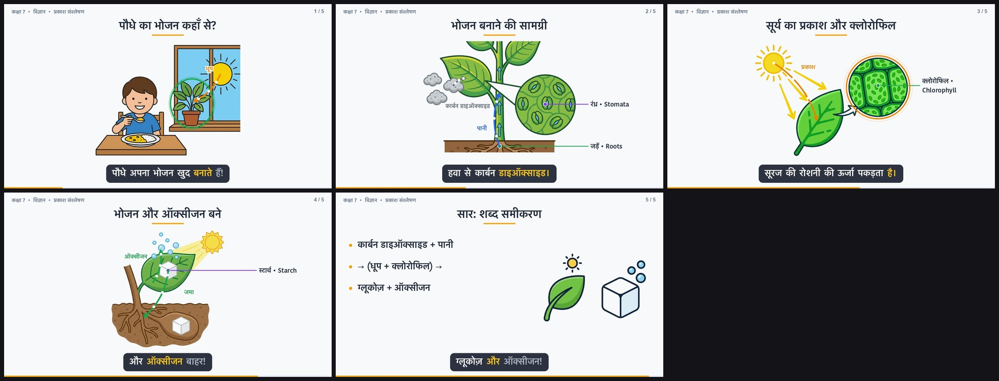

# Run report — Class 7 → Science → Photosynthesis (narration language: Hindi)

| | |
|---|---|
| Final video | `final.mp4` — **48.32s** (audio 48.32s, drift 0 ms) |
| Final QA | PASS |
| Scenes | 5 |
| Captions | 16 chunks, 72 word timestamps |
| Pen actions (write / draw / label / arrow) | 30 total, 15 started on their spoken cue word |
| TTS rate | +0% |
| API calls / cost | 31 calls, $1.555 across 2 sessions (resumed) |
| Wall time (this session) | 38s |

## Models

| Role | Model |
|---|---|
| planner | `anthropic/claude-opus-5.5` |
| writer | `anthropic/claude-opus-5.5` |
| reviewer | `openai/gpt-5.5` |
| vision | `google/gemini-3.1-pro-preview` |
| audio | `google/gemini-3.1-pro-preview` |
| image | `google/gemini-3-pro-image` |
| narration (TTS) | `elevenlabs:rqIg3iVrlZOAkxCMdelQ:eleven_v3` |

## Lesson plan (Planner agent)

**Objectives:**
- Explain that green plants make their own food by photosynthesis
- Identify the raw materials: carbon dioxide from air, water from soil, sunlight and chlorophyll
- State that glucose (food) and oxygen are produced and write the word equation

**Visual style:** Clean flat vector illustration with bold dark outlines, simple bright greens, yellows and blues, on a pure white background, textbook-diagram style with no text.

## Script review loop (Writer ⇄ Reviewer)

| Round | Score | Approved | Blocking issues |
|---|---|---|---|
| 1 | 8/10 | ✅ |  |

## Duration control loop (Narrator → Orchestrator → Writer)

| Round | Total (s) | Per-scene audio (s) |
|---|---|---|
| 1 | 48.28 | s1: 7.65, s2: 10.23, s3: 8.79, s4: 9.99, s5: 8.62 |
| 1 | 48.28 | s1: 7.65, s2: 10.23, s3: 8.79, s4: 9.99, s5: 8.62 |

## Scenes

### 1. पौधे का भोजन कहाँ से? — _Where does a plant get food?_

> हम खाना खाते हैं, पर यह पौधा? देखिए, पौधे अपना भोजन खुद बनाते हैं!

- **Timing:** narration 2.00s → 9.65s (7.65s), visual slot 1.55s → 9.65s
- **Audio QA:** voice `elevenlabs:rqIg3iVrlZOAkxCMdelQ:eleven_v3`, timestamps `tts` (coverage 100%), ASR similarity **0.98**
- **Layout:** diagram; drawing: _Clean flat vector illustration with bold dark outlines, simple bright greens, yellows and blues, on a pure white background, textbook-diagram style with no text_
- **Synced pen actions:** title @ 1.85s, draw @ 2.90s, color @ 4.21s, highlight “plant” @ 4.21s on “यह पौधा” (spoken 3.98s), arrow “धूप” @ 7.70s on “भोजन खुद बनाते” (spoken 7.70s)
- **Visual:** cached; attempts: #1 score 6, #2 score 10 ✅

### 2. भोजन बनाने की सामग्री — _Ingredients for food_

> तो सामग्री क्या है? जड़ें मिट्टी से पानी लेती हैं, और पत्ती के रंध्र हवा से कार्बन डाइऑक्साइड।

- **Timing:** narration 9.65s → 19.88s (10.23s), visual slot 9.65s → 19.88s
- **Audio QA:** voice `elevenlabs:rqIg3iVrlZOAkxCMdelQ:eleven_v3`, timestamps `tts` (coverage 100%), ASR similarity **1.00**
- **Layout:** diagram; drawing: _Clean flat vector illustration with bold dark outlines, simple bright greens, yellows and blues, on a pure white background, textbook-diagram style with no text_
- **Synced pen actions:** title @ 9.90s, draw @ 10.96s, color @ 13.18s, label “जड़ें • Roots” @ 13.30s on “मिट्टी से पानी” (spoken 13.30s), arrow “पानी” @ 14.54s on “लेती हैं” (spoken 14.54s), label “रंध्र • Stomata” @ 16.74s on “रंध्र हवा” (spoken 16.74s), arrow “कार्बन डाइऑक्साइड • CO₂” @ 18.26s on “कार्बन डाइऑक्साइड।” (spoken 18.26s)
- **Visual:** cached; attempts: #1 score 10 ✅

### 3. सूर्य का प्रकाश और क्लोरोफिल — _Sunlight and chlorophyll_

> पर पकाएगा कौन? पत्ती का हरा रंग, क्लोरोफिल, सूरज की रोशनी की ऊर्जा पकड़ता है।

- **Timing:** narration 19.88s → 28.67s (8.79s), visual slot 19.88s → 28.67s
- **Audio QA:** voice `elevenlabs:rqIg3iVrlZOAkxCMdelQ:eleven_v3`, timestamps `tts` (coverage 100%), ASR similarity **1.00**
- **Layout:** diagram; drawing: _Clean flat vector illustration with bold dark outlines, simple bright greens, yellows and blues, on a pure white background, textbook-diagram style with no text_
- **Synced pen actions:** title @ 20.13s, draw @ 21.50s, color @ 24.18s, label “क्लोरोफिल • Chlorophyll” @ 24.30s on “क्लोरोफिल,” (spoken 24.30s), arrow “प्रकाश” @ 26.34s on “रोशनी की ऊर्जा” (spoken 26.34s), highlight “chloroplast_inset” @ 27.70s on “पकड़ता है।” (spoken 27.70s)
- **Visual:** cached; attempts: #1 score 10 ✅

### 4. भोजन और ऑक्सीजन बने — _Food and oxygen are made_

> बनता है ग्लूकोज़, यानी भोजन, जो स्टार्च बनकर जमा होता है, और ऑक्सीजन बाहर!

- **Timing:** narration 28.67s → 38.66s (9.99s), visual slot 28.67s → 38.66s
- **Audio QA:** voice `elevenlabs:rqIg3iVrlZOAkxCMdelQ:eleven_v3`, timestamps `tts` (coverage 100%), ASR similarity **0.98**
- **Layout:** diagram; drawing: _Clean flat vector illustration with bold dark outlines, simple bright greens, yellows and blues, on a pure white background, textbook-diagram style with no text_
- **Synced pen actions:** title @ 28.92s, draw @ 29.88s, color @ 32.96s, label “स्टार्च • Starch” @ 33.08s on “स्टार्च बनकर” (spoken 33.08s), arrow “जमा” @ 34.84s on “होता है,” (spoken 34.84s), arrow “ऑक्सीजन • O₂” @ 36.52s on “ऑक्सीजन बाहर!” (spoken 36.52s)
- **Visual:** cached; attempts: #1 score 6, #2 score 10 ✅

### 5. सार: शब्द समीकरण — _Recap: word equation_

> कार्बन डाइऑक्साइड और पानी, धूप और क्लोरोफिल से, ग्लूकोज़ और ऑक्सीजन!

- **Timing:** narration 38.66s → 47.28s (8.62s), visual slot 38.66s → 48.32s
- **Audio QA:** voice `elevenlabs:rqIg3iVrlZOAkxCMdelQ:eleven_v3`, timestamps `tts` (coverage 100%), ASR similarity **0.98**
- **Layout:** board; drawing: _Clean flat vector illustration with bold dark outlines, simple bright greens, yellows and blues, on a pure white background, textbook-diagram style with no text_
- **Synced pen actions:** title @ 38.91s, draw @ 39.74s, color @ 42.14s, writes “कार्बन डाइऑक्साइड + पानी” @ 40.88s on “और पानी,” (spoken 40.88s), writes “→ (धूप + क्लोरोफिल) →” @ 43.17s on “और क्लोरोफिल” (spoken 43.17s), writes “ग्लूकोज़ + ऑक्सीजन” @ 44.88s on “ग्लूकोज़ और” (spoken 44.88s)
- **Visual:** cached; attempts: #1 score 10 ✅

## Final QA (vision check of rendered keyframes)

| Scene | Visual matches | Captions legible | Glitch | Notes |
|---|---|---|---|---|
| 1 | ✅ | ✅ | — |  |
| 2 | ✅ | ✅ | — |  |
| 3 | ✅ | ✅ | — |  |
| 4 | ✅ | ✅ | — |  |
| 5 | ✅ | ✅ | — |  |

## Keyframes



## Agent event log

```
[   0.0s] orchestrator    start     Class 7 → Science → Photosynthesis (narration language: Hindi)
[   0.0s] orchestrator    models    preset 'best': planner=anthropic/claude-opus-5.5, writer=anthropic/claude-opus-5.5, reviewer=openai/gpt-5.5, vision=google/gemini-3.1-pro-preview, audio=google/gemini-3.1-pro-preview, image=google/gemini-3-pro-image
[   0.0s] orchestrator    tts       narration engine: ElevenLabs eleven_v3 voice rqIg3iVrlZOAkxCMdelQ (whole-lesson take)
[   0.0s] planner         start     planning scenes for Class 7 → Science → Photosynthesis (narration language: Hindi)
[  12.9s] planner         done      5 scenes: Where does a plant get food? | Ingredients for food | Sunlight and chlorophyll | Food and oxygen are made | Recap: word equation
[  12.9s] writer          draft     writing 5 scenes (~67 words @ 1.45 w/s)
[  54.7s] script_reviewer issue     [minor/coherence] scene 5: The word equation is implied but not clearly written or spoken as an equation. The learning objective specifically asks to state/write the word equation.
[  54.7s] script_reviewer issue     [minor/language] scene 2: “पत्ती के रंध्र हवा से कार्बन डाइऑक्साइड” is elliptical; the verb is missing. Also, some Class 7 students may need a quick reminder of what ‘रंध्र’ means.
[  54.7s] script_reviewer issue     [minor/factual] scene 3: “पत्ती का हरा रंग, क्लोरोफिल” is a simplification; chlorophyll is the green pigment present in leaves, not just the colour itself.
[  54.7s] script_reviewer verdict   1: APPROVED score=8/10, 0 blocking issue(s) — Script is scientifically sound overall, age-appropriate for Class 7, and has a conversational teacher-like tone. All three learning objectiv
[  54.7s] storyboard      draft     planning drawings and synced annotations for 5 scenes
[  96.4s] storyboard      rule      scene 2 arrow 'CO₂': text must start with the Hindi term
[  96.4s] storyboard      rule      scene 4 arrow 'O₂': target 'top' is not an element id ['leaf', 'food', 'roots', 'oxygen']
[  96.4s] storyboard      rule      scene 4 arrow 'O₂': text must start with the Hindi term
[  96.4s] storyboard      verdict   round 1: INVALID — 3 issue(s)
[  96.4s] storyboard      repair    fixing 3 issue(s)
[ 124.1s] storyboard      verdict   round 2: VALID — s1:diagram/2, s2:diagram/4, s3:diagram/3, s4:diagram/3, s5:board/3 (15 synced annotations)
[ 124.1s] orchestrator    fanout    visual agent and narrator agent running in parallel
[ 124.1s] visual          start     drawing 5 illustrations with google/gemini-3-pro-image
[ 124.1s] narrator        tts       whole lesson take 1: ElevenLabs eleven_v3 voice rqIg3iVrlZOAkxCMdelQ speed 1.15 (387 chars, 5 scenes in one take)
[ 142.1s] narrator        slice     take 1: 45.28s cut into scenes at the natural pauses → s1:7.7s, s2:10.2s, s3:8.8s, s4:10.0s, s5:8.6s
[ 159.4s] audio_qa        verdict   scene 4: PASS 9.99s, 1.55 w/s, timestamps=tts coverage=100%, offset +201 ms (MAD 27 ms over 4 pause anchors), ASR sim=0.98
[ 166.1s] audio_qa        verdict   scene 5: PASS 8.62s, 1.42 w/s, timestamps=tts coverage=100%, offset +235 ms (MAD 72 ms over 4 pause anchors), ASR sim=0.98
[ 170.6s] audio_qa        verdict   scene 3: PASS 8.79s, 1.89 w/s, timestamps=tts coverage=100%, offset +178 ms (MAD 8 ms over 3 pause anchors), ASR sim=1.00
[ 181.0s] audio_qa        verdict   scene 2: PASS 10.23s, 2.08 w/s, timestamps=tts coverage=100%, offset +263 ms (MAD 60 ms over 7 pause anchors), ASR sim=1.00
[ 192.3s] audio_qa        verdict   scene 1: PASS 7.65s, 1.96 w/s, timestamps=tts coverage=100%, offset +135 ms (MAD 57 ms over 4 pause anchors), ASR sim=0.98
[ 192.3s] orchestrator    duration  round 1: 48.3s is inside 31.5-58.5s ✓
[ 213.4s] grounder        locate    scene 2: located 5/5 parts
[ 213.4s] visual_critic   verdict   scene 2 attempt 1: APPROVED score=10/10
[ 213.4s] visual          select    scene 2: using scene_2_try1.png
[ 238.0s] grounder        locate    scene 5: located 2/2 parts
[ 238.0s] visual_critic   verdict   scene 5 attempt 1: APPROVED score=10/10
[ 238.1s] visual          select    scene 5: using scene_5_try1.png
[ 253.0s] visual_critic   verdict   scene 1 attempt 1: REJECTED score=6/10 — The sun is drawn overlapping the window frame (the vertical and horizontal bars), making it look like it is inside the room or pasted on top of the window rathe
[ 265.3s] visual_critic   verdict   scene 4 attempt 1: REJECTED score=6/10 — The sugar cube symbols contain a garbled letter 'E' on them, violating the text-free requirement.
[ 284.1s] grounder        locate    scene 3: located 4/4 parts
[ 284.1s] visual_critic   verdict   scene 3 attempt 1: APPROVED score=10/10
[ 284.2s] visual          select    scene 3: using scene_3_try1.png
[ 303.5s] grounder        locate    scene 1: located 4/4 parts
[ 303.5s] visual_critic   verdict   scene 1 attempt 2: APPROVED score=10/10
[ 303.6s] visual          select    scene 1: using scene_1_try2.png
[ 356.7s] grounder        locate    scene 4: located 4/4 parts
[ 356.7s] visual_critic   verdict   scene 4 attempt 2: APPROVED score=10/10
[ 356.8s] visual          select    scene 4: using scene_4_try2.png
[ 356.9s] sync            calibrate scene 1: TTS timestamps shifted +135 ms to match audible speech
[ 356.9s] sync            calibrate scene 2: TTS timestamps shifted +263 ms to match audible speech
[ 356.9s] sync            calibrate scene 3: TTS timestamps shifted +178 ms to match audible speech
[ 356.9s] sync            calibrate scene 4: TTS timestamps shifted +201 ms to match audible speech
[ 356.9s] sync            calibrate scene 5: TTS timestamps shifted +235 ms to match audible speech
[ 356.9s] sync            validate  timeline OK: captions monotonic, events inside their scenes, narration inside visual slots
[ 356.9s] sync            done      timeline 48.32s (1208 frames), 16 captions, 30 animation events; 15 cued to spoken words, median start lag 0 ms
[ 356.9s] renderer        start     rendering whiteboard video 48.32s @ 25fps 1280x720
[ 364.6s] renderer        done      wrote final.mp4 (2.9 MB)
[ 364.8s] final_qa        probe     video 48.320s, audio 48.320s, drift 0 ms, decode OK
[ 405.2s] final_qa        frame     scene 1: ok
[ 405.2s] final_qa        frame     scene 2: FLAG — Text on the cloud is mis-rendered as 'किर्बन' instead of 'कार्बन'.
[ 405.2s] final_qa        frame     scene 3: ok
[ 405.2s] final_qa        frame     scene 4: ok
[ 405.2s] final_qa        frame     scene 5: ok
[ 405.2s] final_qa        verdict   FAIL — scene 2: caption/render issue: Text on the cloud is mis-rendered as 'किर्बन' instead of 'कार्बन'.
[ 405.2s] orchestrator    warn      final QA not fully satisfied: scene 2: caption/render issue: Text on the cloud is mis-rendered as 'किर्बन' instead of 'कार्बन'.
[ 405.2s] orchestrator    done      output/class7-science-photosynthesis-hi-20260924-201621/final.mp4 (48.3s) — 30 API calls, $1.507, 405s wall time
---- resumed session ----
[   0.0s] orchestrator    start     Class 7 → Science → Photosynthesis (narration language: Hindi)
[   0.0s] orchestrator    models    preset 'best': planner=anthropic/claude-opus-5.5, writer=anthropic/claude-opus-5.5, reviewer=openai/gpt-5.5, vision=google/gemini-3.1-pro-preview, audio=google/gemini-3.1-pro-preview, image=google/gemini-3-pro-image
[   0.0s] orchestrator    tts       narration engine: ElevenLabs eleven_v3 voice rqIg3iVrlZOAkxCMdelQ (whole-lesson take)
[   0.0s] orchestrator    resume    loaded plan.json
[   0.0s] orchestrator    resume    loaded approved script.json
[   0.0s] orchestrator    resume    loaded valid storyboard.json
[   0.0s] orchestrator    fanout    visual agent and narrator agent running in parallel
[   0.0s] narrator        cache     lesson narration unchanged, reusing the ElevenLabs take
[   0.0s] visual          start     drawing 5 illustrations with google/gemini-3-pro-image
[   0.0s] orchestrator    duration  round 1: 48.3s is inside 31.5-58.5s ✓
[   0.0s] visual          cache     scene 2: approved drawing unchanged — reusing
[   0.0s] visual          cache     scene 1: approved drawing unchanged — reusing
[   0.0s] visual          cache     scene 3: approved drawing unchanged — reusing
[   0.0s] visual          cache     scene 5: approved drawing unchanged — reusing
[   0.0s] visual          cache     scene 4: approved drawing unchanged — reusing
[   0.2s] sync            calibrate scene 1: TTS timestamps shifted +135 ms to match audible speech
[   0.2s] sync            calibrate scene 2: TTS timestamps shifted +263 ms to match audible speech
[   0.2s] sync            calibrate scene 3: TTS timestamps shifted +178 ms to match audible speech
[   0.2s] sync            calibrate scene 4: TTS timestamps shifted +201 ms to match audible speech
[   0.2s] sync            calibrate scene 5: TTS timestamps shifted +235 ms to match audible speech
[   0.2s] sync            validate  timeline OK: captions monotonic, events inside their scenes, narration inside visual slots
[   0.2s] sync            done      timeline 48.32s (1208 frames), 16 captions, 30 animation events; 15 cued to spoken words, median start lag 0 ms
[   0.2s] renderer        start     rendering whiteboard video 48.32s @ 25fps 1280x720
[   8.2s] renderer        done      wrote final.mp4 (2.9 MB)
[   8.5s] final_qa        probe     video 48.320s, audio 48.320s, drift 0 ms, decode OK
[  38.1s] final_qa        frame     scene 1: ok
[  38.1s] final_qa        frame     scene 2: ok
[  38.1s] final_qa        frame     scene 3: ok
[  38.1s] final_qa        frame     scene 4: ok
[  38.1s] final_qa        frame     scene 5: ok
[  38.1s] final_qa        verdict   PASS
```
